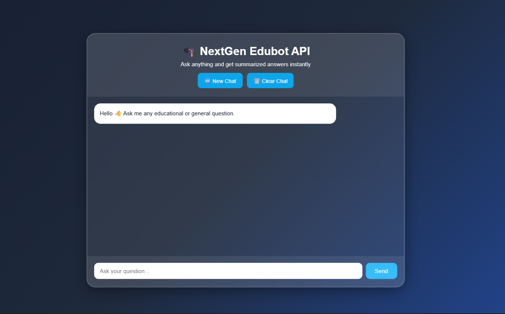
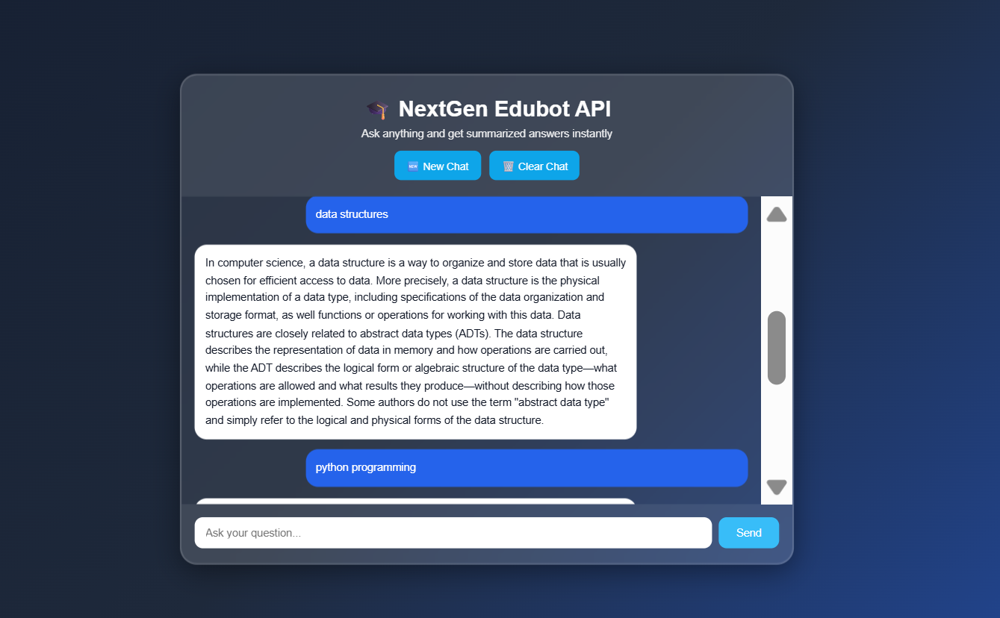

# NextGen_EduBot

NextGen_EduBot is an AI-powered educational chatbot designed to provide instant learning assistance, intelligent responses, and an interactive user experience for students.

The project combines modern web technologies with AI integration to create a smart and responsive chatbot system.  

## Live Demo

### https://nextgen-edubot.onrender.com/

---

#  Features

*  AI-powered chatbot
*  Real-time chat interface
*  Educational assistance
*  Fast response system
*  Modern UI/UX design
*  Fully responsive design
*  Dark themed interface
*  Interactive chatbot experience

---

#  Technologies Used

* Python
* Flask
* HTML5
* CSS3
* JavaScript
* Bootstrap
* Gemini API / OpenAI API

---

#  Screenshots

##  Chat Interface



---

##  Chat Response



---

#  Installation Guide

## 1️ Clone the Repository

```bash
git clone https://github.com/AkramHussain78618/NextGen_EduBot.git
```

---

## 2️ Navigate to Project Folder

```bash
cd NextGen_EduBot
```

---

## 3️ Create Virtual Environment

### Windows

```bash
python -m venv venv
```

---

## 4️ Activate Virtual Environment

```bash
venv\Scripts\activate
```

---

## 5️ Install Dependencies

```bash
pip install -r requirements.txt
```

---

## 6️ Run the Application

```bash
python app.py
```

---

#  Deployment

This project can be deployed using:

* Render

---

#  Project Structure

```bash
NEXTGEN_EDUBOT/
│
├── static/
├── templates/
├── screenshots/
│   ├── chat_interface.png
│   └── chat_response.png
│
├── app.py
├── requirements.txt
└── README.md
```

---

#  Project Objective

The main goal of NEXTGEN_EDUBOT is to help students interact with an AI assistant for educational support, doubt clarification, and smart learning experiences.

---

#  Author

## Hussain bee & Akram Hussain

Aspiring Software Developer passionate about:

* Artificial Intelligence
* Python Development
* Web Technologies
* AI Chatbot Development

---

#  GitHub Support

If you like this project, give it a * on GitHub and support the repository.

---

#  Contribution

Feel free to connect for collaboration and learning opportunities.

 Thank you for visiting NextGen_EduBot.
